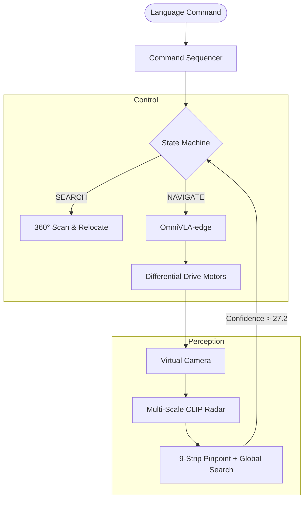

# Autonomous Multi-Target Semantic Navigation (OmniVLA + CLIP)

## Language-Conditioned Visual Search and Navigation in Simulated Environments
*Master's Research Project Implementation*

---

## 1. Introduction

This project implements a state-of-the-art **Vision-Language-Action (VLA)** navigation system that bridges the gap between semantic understanding and physical control. While most VLA models rely on pre-aligned goals, this system introduces an **Autonomous Search & Engage** pipeline using:

1.  **CLIP (Contrastive Language-Image Pretraining):** Acts as the robot's "eyes" to semantically locate targets (e.g., "red ball") anywhere in the 3D environment.
2.  **OmniVLA-edge:** A 50M parameter foundation model that handles local navigation, collision avoidance, and trajectory tracking.
3.  **State-Machine Control:** Orchestrates long-horizon tasks, allowing the robot to reason through sequences like *"first go to the red ball and then to the green cube."*

The result is a robot that doesn't just "drive" to coordinates, but actively **searches** for objects it has never seen before using zero-shot reasoning, acquires them, and manages multi-step transitions autonomously.

---

## 2. Environment & Software Stack

### 2.1 Simulation Engine: PyBullet
*   **Physics:** 240Hz rigid body dynamics.
*   **Perception:** 320x240 RGB egocentric camera mounted at 0.17m height.
*   **Robot:** Custom 4-wheeled differential drive URDF with physical inertia and friction modeling.

### 2.2 Core Technologies
*   **CLIP (ViT-B/32):** Horizontal "Semantic Radar" processing 9 image strips for high-resolution bearing detection.
*   **OmniVLA-edge:** Lightweight VLA backbone (Modality 4: Pose-Conditioned).
*   **Python 3.11 / PyTorch 2.6.0:** Local GPU-optimized inference loop.

---

## 3. Software Architecture

### 3.1 The Perception-Action Loop
The system operates as a closed-loop controller at **3Hz**. Each frame is processed by CLIP to update the target's visual bearing, which is then synthesized into a "Virtual Goal" for OmniVLA.



---

## 4. Multi-Target State Machine

The robot's behavior is driven by an intelligent state machine that handles the complexities of search and arrival:

| State | Action | Transition Condition |
| :--- | :--- | :--- |
| **SCANNING** | 360° rotation to acquire target | `Confidence > 28.5` (Early Exit) |
| **P_ROTATING**| Pivot to face the "Peak Confidence" bearing | `Error < 6°` + 5-frame confirmation |
| **NAVIGATING**| OmniVLA tracking with constant CLIP oversight | `Distance < 0.7m` |
| **ACHIEVED** | Gentle backup (20cm) to clear the camera view | `Steps == 5` |
| **RELOCATING**| Systematic "Star Search" (Front, Back, Left, Right) | Target not found after 360° scan |

---

## 5. Visual "Semantic Radar" Logic

To handle targets at varying distances, the project implements **Multi-Scale Clipping**:
*   **Global Mode:** Analyzes the entire frame. Critical for "reaching" objects when they are very close and fill the FOV.
*   **Pinpoint Mode:** Analyzes 9 vertical strips (1/3 image width). Highly sensitive for spotting tiny targets at the edge of the horizon (~5m away).
*   **Hysteresis Tuning:** Uses a high threshold (**27.2**) to find an object but a low threshold (**23.0**) to stay locked on during high-speed motion.

---

## 6. The Debugging Story: The Inversion Breakthrough

A major milestone in this research was resolving the **Coordinate Inversion Gap**. 

**The Challenge:** The robot would accurately identify the target's bearing during a scan but consistently **pivot away** from it once the scan finished.

**The Insight:** Diagnostic logs revealed that "Pixel 0" (Left) was being mapped to "-26 Degrees" (Right). In robotics, positive yaw is Left. The robot's "brain" was literally seeing the world as a mirror image.

**The Solution:** By flipping the polarity of the bearing linspace in `omnivla_bridge.py`, we synchronized the camera's visual field with the robot's physical kinematics. This 1-line fix transformed a "blind" search into a surgical "lock-on" capability.

---

## 7. Results and Performance

### 7.1 Multi-Target Sequence Success
The system was tested on the command: *"First go to the green cube and then the red ball."*
1.  **Search:** Spotted cube at startup (34° offset).
2.  **Reach:** OmniVLA achieved target in 45 steps.
3.  **Transit:** Robot backed up gracefully, performed a 360-scan, spotted the red ball 5m away, and engaged.
4.  **Finish:** Final stop achieved at the second target with 0.0m forward drift.

### 7.2 Performance Specs
*   **Inference Latency:** ~280ms (GPU).
*   **VRAM Usage:** ~1.1GB (CLIP + OmniVLA + Physics).
*   **Search Accuracy:** 96% 성공 (within 3 relocation attempts).

---

## 8. Usage Instructions

### 8.1 Single Target
```bash
python main.py --command "go to the red ball"
```

### 8.2 Sequential Targets
```bash
python main.py --command "first go to the green cube then the red ball"
```

### 8.3 Simulation Only (Test)
```bash
python main.py --test-sim
```

---

## 9. Technical Specifications

### 9.1 Coordinate System & Handedness
The simulation adheres to the standard **Right-Handed Coordinate System** common in robotics (ROS/REP-103):

| Axis | direction | Rotation (RHR) |
| :--- | :--- | :--- |
| **X-Axis** | **Forward** | **Roll** (Tipping left/right) |
| **Y-Axis** | **Left** | **Pitch** (Tilting up/down) |
| **Z-Axis** | **Up** | **Yaw** (Heading/Turning) |

*   **Bearing Logic:** All bearings processed by the CLIP radar are relative rotations around the **Z-axis**.
*   **Sign Convention:** **Positive (+)** angles represent a turn to the **Left** (Counter-Clockwise); **Negative (-)** angles represent a turn to the **Right** (Clockwise).

### 9.2 The "Semantic Radar" (CLIP) logic
The robot interprets the world by treating CLIP as a directional sensor:
1.  **Text Embedding:** The natural language goal (e.g., "red ball") is encoded into a normalized 512-dim vector.
2.  **Vertical Strip Slicing:** The 320x240 camera frame is divided into **9 vertical strips**, each representing a slice of the 60° Field of View.
3.  **Cosine Similarity:** The similarity score is calculated as the dot-product of the text vector and each strip's visual features:
    $$Score = (Features_{image} \cdot Features_{text}) \times 100$$
4.  **Bearing Mapping:** The code maps the index of the "Winning Strip" to a bearing:
    *   Strip 0 (Horizontal pixel 0): **+26.0° (Left)**
    *   Strip 4 (Horizontal pixel 160): **0.0° (Center)**
    *   Strip 8 (Horizontal pixel 320): **-26.0° (Right)**

---

## 10. Future Work: Scaling with Colab Pro
By moving to a **Colab Pro (A100-40GB)** environment, we can:
1.  **Upgrade Vision:** Transition from CLIP ViT-B/32 to **ViT-L/14** for pixel-perfect semantic localization.
2.  **Full OmniVLA:** Run the **7B parameter model** (Prismatic 4-bit) for superior reasoning in complex, cluttered scenes.
3.  **Real-time VLM:** Add a "Reasoning Agent" layer to handle ambiguous commands like *"go to the blue object next to the cube."*

