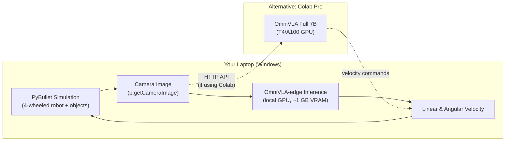
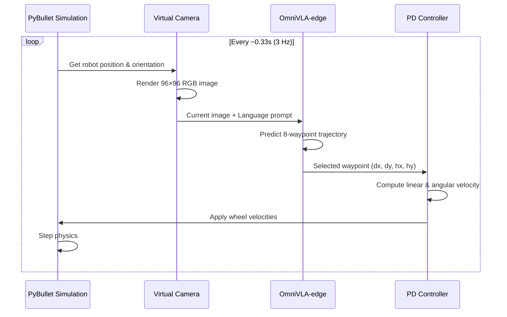

# OmniVLA Simulation Environment — Implementation Plan

## Executive Summary

This plan creates a **PyBullet-based simulation** on your local Windows laptop with a 4-wheeled robot, and uses **OmniVLA-edge (50M params)** running on **Google Colab Pro** as the brain. The simulation renders camera images, sends them to OmniVLA over a network bridge, receives velocity commands back, and moves the robot accordingly.

---

## 1. Feasibility Analysis

### 1.1 Your Hardware Constraints

| Resource | Available | Needed (Simulation) | Needed (OmniVLA Full 7B) | Needed (OmniVLA-edge 50M) |
|---|---|---|---|---|
| **Local GPU VRAM** | 8 GB | ~0 GB (PyBullet is CPU-based) | 16-24 GB ❌ | ~1-2 GB ✅ |
| **Colab Pro GPU** | T4 (16 GB) / A100 (40-80 GB) | N/A | 16+ GB ✅ | Easily ✅ |

### 1.2 Simulation Environment Comparison

| Simulator | GPU Requirement | Windows Support | Complexity | Verdict |
|---|---|---|---|---|
| **NVIDIA Isaac Sim** | Min 16 GB VRAM, needs RT cores | Yes (native) | Very heavy | ❌ **Won't work** on 8 GB |
| **Gazebo** | Needs Linux/WSL2, moderate GPU | Via WSL2 only | Medium-heavy | ⚠️ Possible but complex |
| **PyBullet** | No GPU needed (CPU physics) | Native Python, Windows ✅ | Lightweight | ✅ **Best choice** |

> [!IMPORTANT]
> **PyBullet is the recommended simulator** because it runs natively on Windows, requires no GPU for physics, has built-in rendering for camera images, and is a pure Python package (`pip install pybullet`).

### 1.3 OmniVLA Model Choice

| Model | Params | VRAM for Inference | Fits 8 GB Laptop? | Fits Colab T4 (16 GB)? |
|---|---|---|---|---|
| **OmniVLA (full)** | 7B (OpenVLA-based) | 16-24 GB | ❌ No | ✅ Yes (tight) |
| **OmniVLA-edge** | 50M (ViNT-based) | ~1-2 GB | ✅ Yes | ✅ Yes (easily) |

> [!TIP]
> **Primary plan: Run OmniVLA-edge locally** on your 8 GB GPU — it fits easily. **Fallback: Run on Colab Pro** if local setup has issues.  
> **Bonus option: Run full OmniVLA (7B) on Colab Pro** with a T4/A100 for better accuracy, communicating with your local simulation via an API bridge.

### 1.4 Camera Integration

> [!IMPORTANT]
> **Yes, a camera is required.** OmniVLA is a *vision*-language-action model. It needs an egocentric camera image from the robot's perspective at every timestep to generate navigation actions. PyBullet provides a synthetic camera rendering function (`p.getCameraImage()`) that produces the exact RGB images OmniVLA needs.

### 1.5 Colab Pro + Antigravity as Kernel

> [!WARNING]
> **Colab Pro cannot run a GUI simulation.** Colab has no display server — you cannot render PyBullet's GUI window there. However, you *can* run the OmniVLA model inference on Colab and connect it to your local simulation via a network tunnel (e.g., ngrok or a simple HTTP API). The Antigravity setup with Colab as kernel would work for running inference code, but the simulation GUI must stay local.

---

## 2. Architecture Overview



### Recommended Architecture: **All-Local (Option A)**

Everything runs on your laptop:
1. **PyBullet** renders the simulation and camera
2. **OmniVLA-edge** runs locally on your 8 GB GPU
3. Zero network latency, simplest to set up

### Alternative Architecture: **Split (Option B)**

For better model quality:
1. **PyBullet** runs locally (simulation + camera)
2. **OmniVLA full 7B** runs on Colab Pro
3. Connected via HTTP API + ngrok tunnel
4. Higher latency (~200-500ms per step), but better navigation accuracy

---

## 3. Implementation Plan

### Phase 1: PyBullet Simulation Environment (Local)

**Goal:** Create a flat plane with a 4-wheeled robot, a red ball, and a green cube.

| Step | Description | Details |
|---|---|---|
| 1.1 | Install PyBullet | `pip install pybullet numpy Pillow matplotlib` |
| 1.2 | Create robot URDF | Define a simple 4-wheeled robot with a front-facing camera |
| 1.3 | Create world scene | Flat plane + red ball + green cube at known positions |
| 1.4 | Implement camera | Attach virtual camera to robot, render 96×96 egocentric images |
| 1.5 | Implement motor control | Accept `(linear_vel, angular_vel)` → differential drive wheel commands |
| 1.6 | Create simulation loop | Step physics, render camera, send to model, apply commands |

### Phase 2: OmniVLA-edge Integration (Local)

**Goal:** Load OmniVLA-edge model and run inference in the simulation loop.

| Step | Description | Details |
|---|---|---|
| 2.1 | Clone OmniVLA repo | `git clone https://github.com/NHirose/OmniVLA.git` |
| 2.2 | Download edge checkpoint | `git clone https://huggingface.co/NHirose/omnivla-edge` |
| 2.3 | Set up conda env | Python 3.10, PyTorch 2.2, CLIP, etc. |
| 2.4 | Create bridge module | Adapter that takes PyBullet camera → OmniVLA input format |
| 2.5 | Run closed-loop | Camera → OmniVLA-edge → velocity → robot moves → repeat |

### Phase 3: Language-Conditioned Navigation

**Goal:** "Go to the red ball" → robot navigates to the red ball.

| Step | Description | Details |
|---|---|---|
| 3.1 | Set language prompt | Pass `"go to the red ball"` as `lan_inst_prompt` |
| 3.2 | Set modality flags | `lan_prompt = True`, others `False` (language-only mode) |
| 3.3 | Implement stopping | Stop when robot is within threshold distance of target |
| 3.4 | Visualize trajectory | Record frames and create video/animation |

### Phase 4 (Optional): Colab Pro Full Model

**Goal:** Use the full 7B OmniVLA for better performance.

| Step | Description | Details |
|---|---|---|
| 4.1 | Create Colab notebook | Install OmniVLA, load full model |
| 4.2 | Create FastAPI server | Receive image + language → return velocity |
| 4.3 | Set up ngrok tunnel | Expose Colab's API to your laptop |
| 4.4 | Modify local sim | Send camera images to Colab API instead of local model |

---

## 4. Data Flow (Per Timestep)



---

## 5. Key Technical Details

### OmniVLA-edge Input Requirements
- **Current image:** 96×96 RGB (egocentric camera view)
- **CLIP image:** 224×224 RGB (same image, resized for CLIP encoder)
- **Context queue:** 6 historical frames (we'll use repeated current frame initially)
- **Language prompt:** e.g., `"red ball"` or `"go to the red ball"`
- **Goal pose:** 4D vector `[y/spacing, -x/spacing, cos(θ), sin(θ)]` (can be dummy if using language-only mode)
- **Goal image:** 96×96 (can be a black dummy if using language-only mode)

### OmniVLA-edge Output
- **8 waypoints**, each with 4 values: `(dx, dy, hx, hy)` — forward, lateral, heading components
- PD controller converts waypoint #4 to `(linear_vel, angular_vel)`

### Stopping Condition
- When the robot is within **0.3m** of the target object, stop sending commands

---

## 6. File Structure

```
e:\github\kaushik\phd-cps\omnivla-sim\
├── simulation/
│   ├── robot.urdf          # 4-wheeled robot definition
│   ├── sim_env.py          # PyBullet environment setup
│   ├── camera.py           # Virtual camera rendering
│   └── motor_control.py    # Velocity → wheel commands
├── inference/
│   ├── omnivla_bridge.py   # Adapter: PyBullet ↔ OmniVLA
│   └── colab_client.py     # (Optional) HTTP client for Colab
├── main.py                 # Main simulation loop
├── requirements.txt        # Dependencies
└── README.md               # Instructions
```

---

## 7. Risks & Mitigations

| Risk | Impact | Mitigation |
|---|---|---|
| OmniVLA-edge trained on real-world data, may not generalize to synthetic PyBullet images | Robot may not navigate well | Use realistic textures; fall back to full 7B model on Colab |
| OmniVLA expects specific image characteristics (outdoor, natural lighting) | Poor performance in minimal PyBullet scene | Add floor texture, realistic colors, lighting adjustments |
| CLIP text encoder may not understand arbitrary commands | Limited language flexibility | Use training-distribution prompts like `"red ball"` or `"move toward red ball"` |
| 8 GB GPU might be tight with PyBullet GUI + OmniVLA-edge | OOM errors | PyBullet GUI uses minimal GPU; edge model uses ~1 GB; should be fine |

> [!CAUTION]
> **Sim-to-real gap:** OmniVLA was trained on real-world data from physical robots. Synthetic PyBullet renders look different from real camera images, which may reduce navigation accuracy. This is an inherent limitation of trying any VLA model in simulation without fine-tuning. The plan is still worth trying — OmniVLA-edge with CLIP may generalize reasonably to simple synthetic scenes.

---

## 8. Decisions Needed From You

1. **Option A (all-local) vs Option B (Colab for model)?**  
   Recommendation: Start with **Option A** (simpler). Switch to Option B only if edge model performance is poor.

2. **Ready to proceed?**  
   If yes, I'll start building Phase 1 (PyBullet simulation) and Phase 2 (OmniVLA-edge integration).

3. **Any specific object placement preferences?**  
   Default: Red ball at (3, 2, 0.2), green cube at (-2, 3, 0.15), robot starts at origin facing +X.
